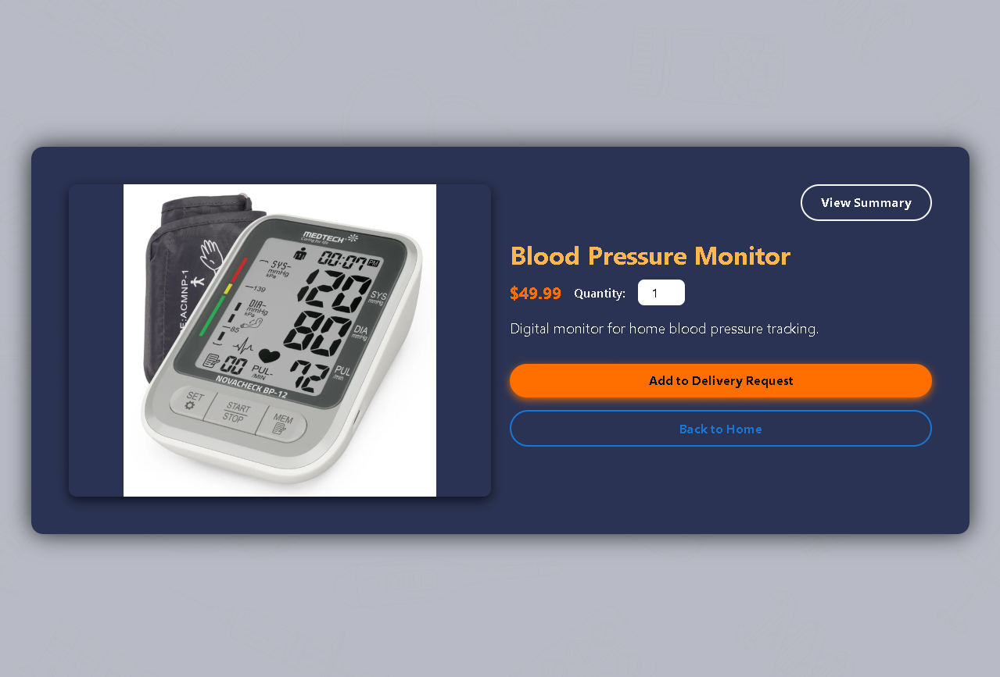
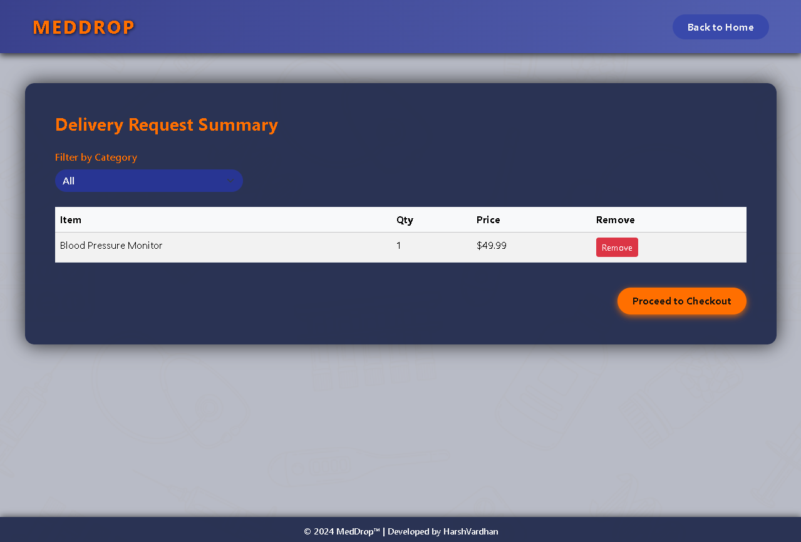

# MedDrop™ Web Application

---

## 🚀 Project Overview

MedDrop™ is a sleek, user-centric web solution designed to simplify the ordering and delivery of medical supplies. It offers dynamic product browsing, delivery request management, and a seamless checkout experience — all optimized with responsive design and smooth real-time updates.

---

## ✨ Key Features

- **Dynamic Product Details**  
  View comprehensive product information with images, pricing, and quantity controls. Add items to a delivery request seamlessly.

- **Delivery Request Summary**  
  Real-time filtering by category and search functionality. Adjust quantities or remove items effortlessly. Prevents empty cart checkout.

- **Intelligent Checkout Process**  
  Capture recipient details and delivery preferences. Automatically calculate total costs including delivery fees. Validates user input to ensure order accuracy.

- **Consistent, Professional Styling**  
  Leveraging Bootstrap 5.3.3 and custom inline CSS for brand-aligned aesthetics. Background image with overlay ensures readability and visual appeal.

---

## 📱 User Interface Screenshots

  
*Main page with product listings and category filter.*

  
*Detailed view for individual products.*

  
*Delivery request summary with filtering and quantity management.*

  
*Checkout page for finalizing the order with delivery options.*

---

## 🔧 Technologies Used

- HTML5, CSS3, JavaScript (ES6+)
- Bootstrap 5.3.3 (CSS & JS bundle)
- Browser localStorage API for persistent client-side data

---

## 💡 Additional Notes

- All cart and order data is stored locally in the browser for instant access without backend dependencies.
- Quantity management intelligently aggregates duplicate items.
- Delivery fee dynamically updates total cost in checkout.
- Navigation flows prioritize usability and clarity, with clear calls-to-action.
- Designed for desktop-first but easily adaptable to smaller viewports.

---

## ™ Trademark Notice

**MedDrop™** is a trademark owned and operated by HarshVardhan. Unauthorized use or reproduction of the MedDrop™ brand or assets is prohibited.

---

## 📞 Contact

For inquiries, feedback, or collaboration opportunities, please reach out to:

**HarshVardhan**  
LinkedIn: https://www.linkedin.com/in/harshvardhan-v-330617260

---

Thank you for exploring MedDrop™ — delivering care, efficiently.  
